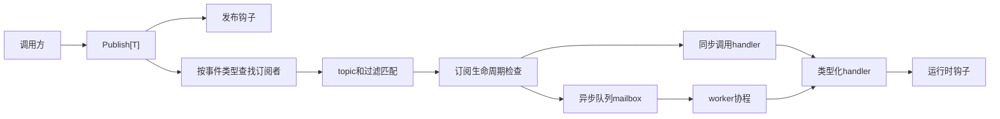

# Busen

`Busen` 是一个小而清晰、typed-first、进程内的 Go 事件总线。

它面向应用内部的本地解耦，强调泛型、`context.Context`、函数式选项
和明确的并发语义。它不是消息代理，也不尝试提供持久化、重放、
跨进程投递或重型运维能力。

## 快速概览

- 范围：只做进程内事件分发
- API 风格：typed-first、基于泛型的发布订阅
- 扩展能力：topic 路由、中间件、钩子、有界异步投递
- 不包含：retry、tracing、metrics、rate limiting、持久化

## 安装

```bash
go get github.com/lin-snow/Busen
```

## 快速开始

```go
package main

import (
	"context"
	"fmt"
	"log"

	"github.com/lin-snow/Busen"
)

type UserCreated struct {
	ID    string
	Email string
}

func main() {
	bus := busen.New()

	unsubscribe, err := busen.Subscribe(bus, func(ctx context.Context, event busen.Event[UserCreated]) error {
		fmt.Printf("welcome %s\n", event.Value.Email)
		return nil
	})
	if err != nil {
		log.Fatal(err)
	}
	defer unsubscribe()

	err = busen.Publish(context.Background(), bus, UserCreated{
		ID:    "u_123",
		Email: "hello@example.com",
	})
	if err != nil {
		log.Fatal(err)
	}

	_ = bus.Close(context.Background())
}
```

## API 选择建议

大多数场景可以按下面方式选 API：

| 场景 | 建议 API |
| --- | --- |
| 只按类型收消息 | `Subscribe[T]` |
| 还需要按 topic 约束 | `SubscribeTopic[T]` |
| 需要按事件内容过滤 | `SubscribeMatch[T]` 或 `WithFilter(...)` |
| 希望调用方同步拿到 handler error | 默认同步订阅 |
| 希望异步投递并显式控制背压 | `Async()` + `WithBuffer(...)` + `WithOverflow(...)` |
| 希望单个订阅者 FIFO | `Sequential()` |
| 希望同一 key 局部有序 | `Async()` + `WithParallelism(...)` + 发布时 `WithKey(...)` |
| 希望观测 publish / panic / drop | `WithHooks(...)` |
| 希望只包裹本地 handler 调用 | `Use(...)` 或 `WithMiddleware(...)` |

## 何时适合使用

| 适合使用 | 不适合使用 |
| --- | --- |
| 你希望在单个 Go 进程内做 typed event 解耦 | 你需要持久化、重放或跨进程投递 |
| 你需要轻量 topic 路由和有界异步投递 | 你需要内置 tracing、metrics、retry 或 rate limiting |
| 你希望使用一个小库，而不是引入事件平台 | 你需要全局顺序保证 |
| 你希望把运维和治理策略放在 bus 外部自行组合 | 你需要更重的消息平台或分布式能力 |

## 为什么存在

- **类型安全的发布订阅**
  使用 `Subscribe[T]` 和 `Publish[T]`，以普通 Go 值作为事件载体。
- **轻量 topic 路由**
  基于 `string` topic 做路由，只提供克制的 wildcard 支持。
- **多种订阅方式**
  支持按类型、topic 模式和谓词过滤订阅。
- **同步与异步投递**
  可以选择直接执行 handler，或使用有界 worker 异步投递。
- **显式背压**
  异步订阅支持 `OverflowBlock`、`OverflowFailFast`、
  `OverflowDropNewest` 和 `OverflowDropOldest`。
- **局部顺序保证**
  支持单 worker FIFO，以及单个异步订阅者内的 per-key 顺序。
- **克制的扩展能力**
  中间件和钩子只用于本地组合，不把库演变成重型框架。

## 架构概览



## Topic 路由

`Busen` 支持点分隔的轻量 topic 路由。

- `*`：匹配恰好一个 segment
- `>`：匹配剩余的一个或多个 segment，且必须位于末尾

```go
sub, err := busen.SubscribeTopic(bus, "orders.>", func(ctx context.Context, event busen.Event[string]) error {
	fmt.Println(event.Topic, event.Value)
	return nil
})
if err != nil {
	log.Fatal(err)
}
defer sub()

_ = busen.Publish(context.Background(), bus, "created", busen.WithTopic("orders.eu.created"))
```

## 异步分发与顺序

异步订阅使用有界队列，背压策略是显式的：

- `OverflowBlock`
- `OverflowFailFast`
- `OverflowDropNewest`
- `OverflowDropOldest`

```go
_, err = busen.Subscribe(bus, func(ctx context.Context, event busen.Event[UserCreated]) error {
	return nil
},
	busen.Async(),
	busen.Sequential(),
	busen.WithBuffer(128),
	busen.WithOverflow(busen.OverflowBlock),
)
```

如果发布时带上 `WithKey(...)`，那么同一 async 订阅者内、相同非空
ordering key 的事件会保持局部顺序：

```go
_, err = busen.Subscribe(bus, func(ctx context.Context, event busen.Event[UserCreated]) error {
	return nil
}, busen.Async(), busen.WithParallelism(4), busen.WithBuffer(256))

_ = busen.Publish(context.Background(), bus, UserCreated{ID: "1"}, busen.WithKey("tenant-a"))
_ = busen.Publish(context.Background(), bus, UserCreated{ID: "2"}, busen.WithKey("tenant-a"))
```

边界说明：

- ordering key 只对 async subscriber 生效
- 空 key 会回退到普通非 keyed 调度
- 顺序保证是 **per subscriber / per key**，不是全局顺序

## Middleware 与 Hooks

### Middleware

`Busen` 提供一个很薄的 dispatch 中间件层，用来做本地组合，而不是做
重型 pipeline 框架。

```go
err = bus.Use(func(next busen.Next) busen.Next {
	return func(ctx context.Context, dispatch busen.Dispatch) error {
		return next(ctx, dispatch)
	}
})
if err != nil {
	log.Fatal(err)
}
```

中间件的边界：

- 只包 handler invocation
- 不替代钩子
- 不承担 retries、metrics、tracing、distributed concerns
- 不影响 subscriber matching、topic routing、async queue selection
- 对 `Dispatch` 的修改只影响后续中间件和最终 handler
- 钩子仍然观察原始 publish 元数据

如果你更喜欢构造期注册方式，也可以使用 `WithMiddleware(...)`：

```go
bus := busen.New(
	busen.WithMiddleware(func(next busen.Next) busen.Next {
		return func(ctx context.Context, dispatch busen.Dispatch) error {
			return next(ctx, dispatch)
		}
	}),
)
```

### 钩子

`Hooks` 用来观察运行时事件，而不是参与 handler 调用链控制。

```go
bus := busen.New(
	busen.WithHooks(busen.Hooks{
		OnPublishDone: func(info busen.PublishDone) {
			log.Printf("matched=%d delivered=%d err=%v", info.MatchedSubscribers, info.DeliveredSubscribers, info.Err)
		},
		OnHandlerError: func(info busen.HandlerError) {
			log.Printf("async=%v topic=%q err=%v", info.Async, info.Topic, info.Err)
		},
		OnHandlerPanic: func(info busen.HandlerPanic) {
			log.Printf("panic in %v: %v", info.EventType, info.Value)
		},
		OnEventDropped: func(info busen.DroppedEvent) {
			log.Printf("dropped event for topic %q with policy %v", info.Topic, info.Policy)
		},
	}),
)
```

当前钩子触发点包括：

- `OnPublishStart`
- `OnPublishDone`
- `OnHandlerError`
- `OnHandlerPanic`
- `OnEventDropped`
- `OnHookPanic`

说明：

- `MatchedSubscribers` 表示路由条件命中的订阅者数量
- `DeliveredSubscribers` 表示通过生命周期检查并真正开始同步调用或异步入队的订阅者数量
- 如果某个钩子自己 panic，`Busen` 默认会恢复该 panic，继续主流程；如需诊断，可以实现 `OnHookPanic`

## 和社区四类模式的差异

这里的四类并不完全处在同一抽象层级，但它们是很多用户在选型时会自然拿来比较的对象。

| 模式 | 更常见的关注点 | 和 `Busen` 的主要差异 | `Busen` 的定位 |
| --- | --- | --- | --- |
| `EventEmitter` | callback 风格、`string`/event-name 驱动、类型约束较弱 | `Busen` 更强调 typed-first、本地并发语义、bounded async delivery、背压和局部顺序 | 更适合需要类型安全和明确并发语义的进程内事件分发 |
| `TypedBus` | 类型安全发布订阅 | 很多 `TypedBus` 只把“类型安全发布/订阅”做得很好，而 `Busen` 在此基础上继续补了 topic、背压、局部顺序、中间件和钩子 | 可以理解成 typed-first，但不止有类型安全这一层能力 |
| `CQRS` | 命令与查询分离的架构模式 | `CQRS` 不等于本地事件总线，也不天然提供本地 pub/sub、topic routing 或 bounded async delivery | 不是 `CQRS` framework，但可以作为 CQRS 体系中的本地事件分发组件 |
| `Mediator` | request/handler 组织、一对一协调、中心化调用 | `Mediator` 更强调协调调用而不是事件广播，也不一定提供真正的 async pub/sub 语义 | 更适合做事件广播式解耦，而不是中心化业务调度 |

## 性能测试

`Busen` 已经内置了可重复运行的 benchmark，主要覆盖这些热路径：

- `Publish[T]` 在 `1 / 10 / 100` 个订阅者下的成本
- sync 与 async sequential 的差异
- async keyed delivery
- middleware 开启/关闭
- middleware + hooks 同时开启
- async keyed + topic routing
- exact / wildcard 路由
- direct router matcher 成本

运行方式：

```bash
go test ./... -run '^$' -bench . -benchmem
```

这些数字代表的是 **in-process event bus 的热路径开销**，不是消息系统吞吐保证。

在一台 Apple M4 机器上的一轮参考结果大致为：

| 场景 | 参考耗时 |
| --- | --- |
| sync publish（1 subscriber） | 约 `111 ns/op` |
| sync publish（10 subscribers） | 约 `575 ns/op` |
| async sequential publish | 约 `200 ns/op` |
| async keyed publish | 约 `273 ns/op` |
| middleware-enabled publish | 约 `111 ns/op` |
| middleware + hooks publish | 约 `127 ns/op` |
| async keyed + topic publish | 约 `290 ns/op` |
| exact topic publish | 约 `127 ns/op` |
| wildcard topic publish | 约 `131 ns/op` |

这一轮里，router matcher 依然保持 `0 allocs/op`：

| matcher | 参考耗时 | 分配 |
| --- | --- | --- |
| exact matcher | 约 `1.5 ns/op` | `0 allocs/op` |
| wildcard matcher | 约 `6.1 ns/op` | `0 allocs/op` |

## 设计边界

- 类型匹配是精确的，不会自动按接口层级分发
- 不保证全局顺序
- `Sequential()` 本质上是 single-worker async FIFO 的 shorthand
- 非空 ordering key 只提供局部顺序保证
- sync handler 错误会直接返回给 `Publish`
- async handler error / panic 不会回传给 `Publish`，应通过 `Hooks` 观察
- `Close(ctx)` 超时只表示未在期限内 drain 完成，不会强制终止用户 handler
- 这是一个简单 app 使用的小库，不是 distributed event platform

## 开发

常用本地命令已经放在 `Makefile` 里：

```bash
make help
make fmt
make lint
make vet
make test
make test-race
make cover
make check
```

`make lint` 会用当前 Go toolchain 把 `golangci-lint` `v2.3.0` 安装到 `./.bin`，避免和 `go.mod` 中声明的 Go 版本产生偏差。

## 相关文档

- 支持与提问：`SUPPORT.md`
- 贡献指南：`CONTRIBUTING.md`
- 安全策略：`SECURITY.md`
- 发布流程：`RELEASING.md`
- 项目治理：`GOVERNANCE.md`
- 行为准则：`CODE_OF_CONDUCT.md`
